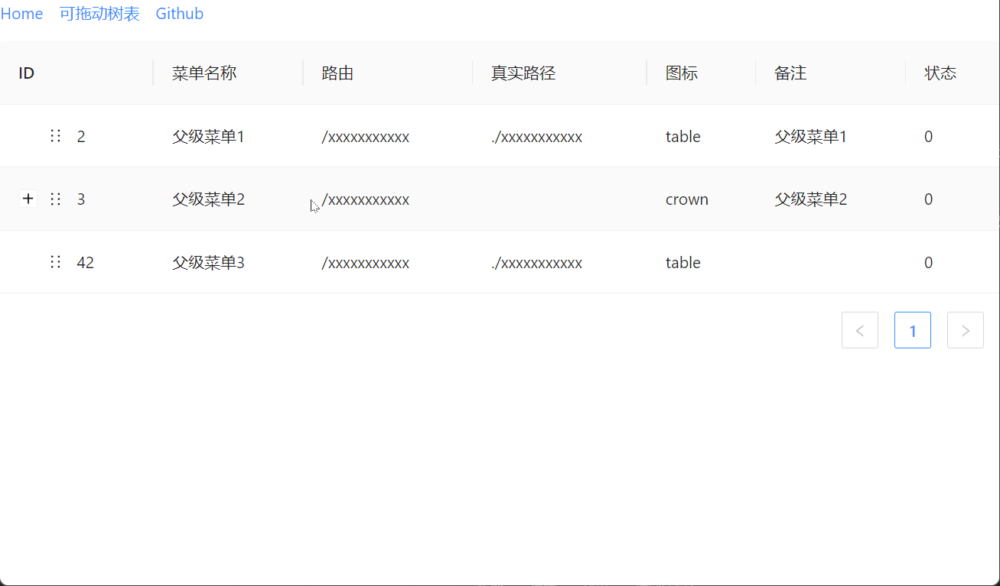

# 简介

基于 Ant desgin Table组件的可拖动版本，可以排序和改变父节点。

## 示例



## 运行

推荐使用`pnpm`管理包。

```sh
git clone https://github.com/scfido/dragable-antd-tree-table
cd dragable-antd-tree-table
pnpm install
pnpm dev
```

如果没有`pnpm`，请先安装。

```sh
npm install -g pnpm
```